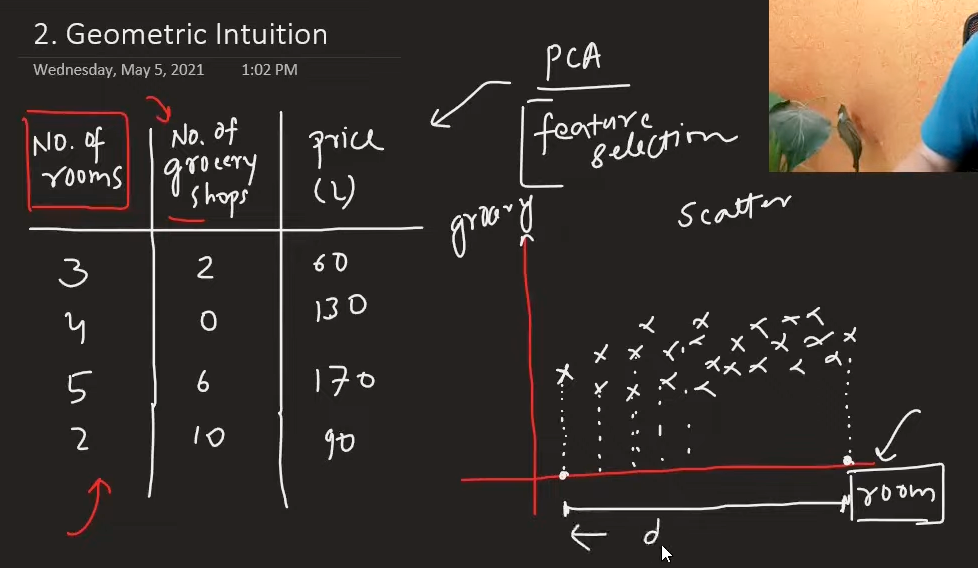
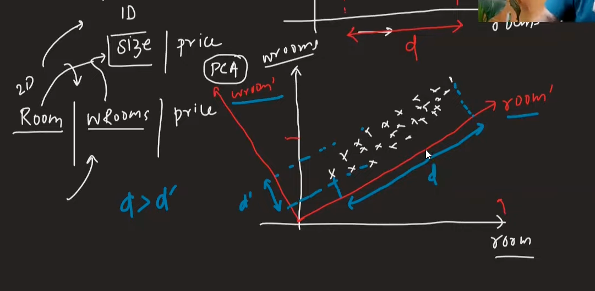
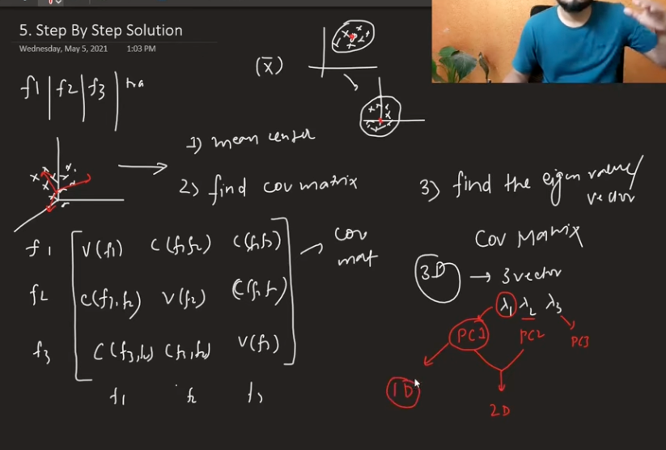

# Principal Component Analysis (PCA)

## What is PCA?

**Principal Component Analysis (PCA)** is an unsupervised learning technique used for dimensionality reduction and feature extraction. PCA finds the best possible lower-dimensional representation of data while preserving the essential information and patterns.

**In simple terms**: PCA automatically finds the most important patterns in your data and presents them in fewer, easier-to-work-with dimensions while keeping 95% of the original information.

## Key Concepts

### 1. Dimensionality Reduction
PCA reduces the number of features (dimensions) in your dataset while maintaining the most important information. This helps with:
- **Faster algorithm execution**
- **Data visualization** (reducing to 2D or 3D)
- **Reducing overfitting**
- **Eliminating noise**



### 2. Variance and Information
- **Variance** is a statistical measure that describes the spread of data
- **Higher variance = More information**
- PCA selects dimensions with the highest variance to preserve maximum information

### 3. Coordinate System Rotation
PCA doesn't just select existing features - it creates new coordinate axes by rotating the original ones to find directions with maximum variance.

**Why rotation is necessary**: The original coordinate system (your original features) may not align with the directions where your data varies the most, so PCA rotates to find the optimal directions that capture maximum information.

**Key Insight**: PCA rotates coordinate axes to make new coordinate axes and then checks the variance of columns. It selects the column which has the highest spread.

**Feature Selection vs PCA**:
- Feature selection can be useful when variance is high in one column and low in another
- PCA goes beyond simple selection by creating optimal combinations



## Mathematical Foundation

### Covariance vs Variance

**Variance**: Measures spread within a single variable
```
Var(X) = Σ(xi - μ)² / n
```

**Covariance**: Measures relationship between two variables
```
Cov(X,Y) = Σ(xi - μx)(yi - μy) / n
```

**Key Differences**:
- Variance describes spread of individual columns
- Covariance describes relationships between columns
- Correlation is normalized covariance (range: -1 to 1)

**Important Note**: Spread is directly proportional to variance. Higher spread means more variance, which means more information.

**Covariance vs Correlation**:
- Covariance specifies the relationship between columns, variance doesn't
- If datapoint is (x,y), covariance is calculated using: Σ(xi × yi) / n
- Correlation and covariance are the same concept, but correlation values are normalized to range from -1 to 1

### Covariance Matrix
A matrix showing covariance between all pairs of variables:
```
Cov_Matrix = [Var(X)    Cov(X,Y)]
             [Cov(Y,X)  Var(Y)  ]
```

## Eigenvalues and Eigenvectors

### What are Eigenvectors?
- **Eigenvectors** are special vectors that don't change direction when linear transformations are applied
- They only change in magnitude (length)
- Number of eigenvectors = number of dimensions (1D has 1 eigenvector, 2D has 2, etc.)

### What are Eigenvalues?
- **Eigenvalues** represent how much the eigenvector's magnitude changes
- The amount of magnitude change is represented by eigenvalues
- Larger eigenvalues = more important principal components
- They indicate the amount of variance explained by each component



## PCA Algorithm Steps

### Step 1: Mean Centering
Make the data mean centered by subtracting the mean from each feature:
```
X_centered = X - μ
```

### Step 2: Calculate Covariance Matrix
Find the covariance matrix of the centered data:
```
C = (1/n) × X_centered^T × X_centered
```

### Step 3: Find Eigenvalues and Eigenvectors
Find eigenvalues and eigenvectors by solving:
```
C × v = λ × v
```
Where:
- `v` = eigenvector
- `λ` = eigenvalue


### Step 4: Sort by Eigenvalues
- Sort eigenvectors by their corresponding eigenvalues (largest first)
- The first few eigenvectors explain most of the variance

### Step 5: Transform Data
To transform points, use:
```
X_transformed = U^T × X
```
Where:
- `U` = matrix of eigenvectors (principal components)
- `U^T` = transpose of U (U transpose)

## Choosing Number of Components

### Methods to Determine Components

1. **Variance Explained**: Keep components that explain 95% of total variance
2. **Scree Plot**: Look for "elbow" in the plot of eigenvalues
3. **Kaiser Criterion**: Keep components with eigenvalues > 1
4. **Cross-Validation**: Test different numbers of components

### Example
If you have 100 features and want to reduce to 10:
- First 10 principal components should explain most variance
- Remaining 90 components explain very little variance

## Applications of PCA

### 1. Data Visualization
- Reduce high-dimensional data to 2D or 3D for plotting
- Identify clusters and patterns visually

### 2. Feature Reduction
- Remove redundant features
- Reduce computational complexity
- Prevent overfitting

### 3. Noise Reduction
- Remove components with low variance (often noise)
- Keep only the most informative dimensions

### 4. Data Compression
- Store data in fewer dimensions
- Reduce storage requirements

## Advantages of PCA

1. **Dimensionality Reduction**: Reduces number of features
2. **Noise Reduction**: Removes low-variance components
3. **Visualization**: Enables plotting of high-dimensional data
4. **Unsupervised**: No need for target variable
5. **Linear Transformation**: Preserves linear relationships

## Limitations of PCA

1. **Linear Assumption**: Only captures linear relationships
2. **Interpretability**: Principal components may not have clear meaning
3. **Scale Sensitivity**: Requires standardized data
4. **Information Loss**: Some information is always lost
5. **Computational Cost**: Can be expensive for very large datasets

## Best Practices

### 1. Data Preprocessing
- **Standardize features**: Ensure all features are on similar scales
- **Handle missing values**: Complete or impute missing data
- **Remove outliers**: They can significantly affect PCA

### 2. Component Selection
- **Start with variance explained**: Aim for 95% variance retention
- **Use cross-validation**: Test performance with different component counts
- **Consider interpretability**: Sometimes fewer, interpretable components are better

### 3. Validation
- **Check reconstruction error**: How well can you reconstruct original data?
- **Validate on test set**: Ensure PCA works on unseen data
- **Monitor performance**: Track model performance with reduced dimensions

## Common Pitfalls

1. **Not standardizing data**: PCA is sensitive to feature scales
2. **Using too many components**: Defeats the purpose of dimensionality reduction
3. **Ignoring interpretability**: Sometimes domain knowledge is more important
4. **Not validating**: Always test if PCA improves your model
5. **Assuming linear relationships**: PCA only captures linear patterns

## Summary

PCA is a powerful technique for dimensionality reduction that:
- Finds the most informative directions in your data
- Reduces computational complexity
- Enables visualization of high-dimensional data
- Removes noise and redundant information

Remember: PCA is a tool, not a magic solution. Always validate that it improves your specific use case and consider the trade-offs between dimensionality reduction and information preservation.