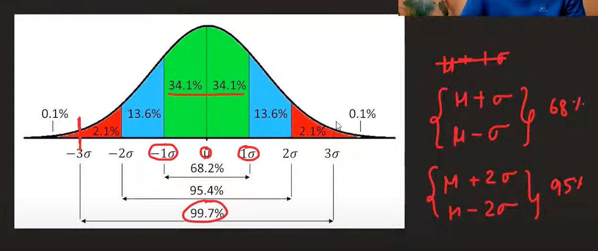
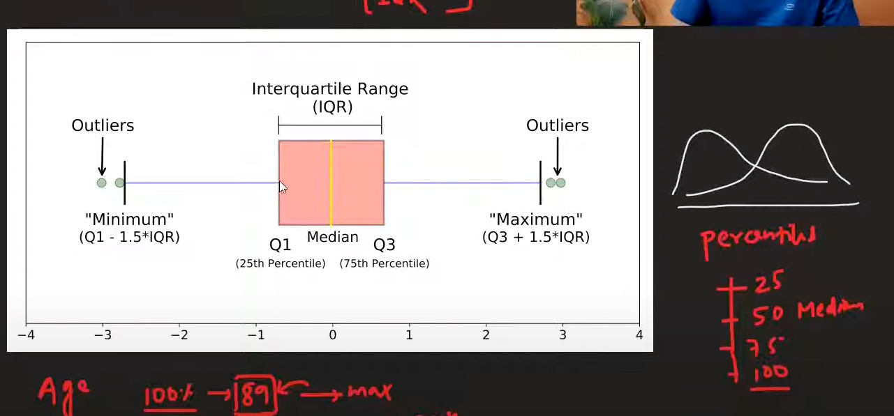

# Outlier Detection and Handling

Outliers have more effect on algorithms that use weights (like linear regression, neural networks). Tree-based algorithms are less affected by outliers due to their splitting mechanism.

## Handling Outliers

### 1. Trimming
- **Method**: Remove outliers completely
- **Effect**: Data becomes smaller and processing is faster
- **Use when**: Outliers are clearly errors or noise

### 2. Capping (Winsorization)
- **Method**: Replace outliers with cap values instead of removing them
- **Process**: 
  - Define a range (min, max)
  - Values outside range are replaced with cap values
  - Original extreme values are removed
- **Use when**: You want to keep data size but reduce outlier impact

### 3. Treat as Missing Values
- **Method**: Replace outliers with NaN and use missing value imputation
- **Use when**: Outliers might contain useful information

### 4. Discretization
- **Method**: Use binning or binarization to group outliers
- **Use when**: You want to convert continuous outliers to categories

## Outlier Detection Methods

### 1. Z-Score Method

**Formula:**
```
Z = (X_i - μ) / σ
```

Where:
- X_i = individual data point
- μ = mean of the dataset
- σ = standard deviation of the dataset

**Rule:**
- If -3 ≤ Z ≤ 3, then it's **not an outlier**
- If Z < -3 or Z > 3, then it's **an outlier**

**When to use:**
- Data is normally distributed
- You want a statistical approach based on standard deviations

**Handling outliers:**
- **Trimming**: Remove the outlier completely
- **Capping**: Replace with the cap value (e.g., 3 or -3)



### 2. Interquartile Range (IQR) Method

**Formula:**
```
IQR = Q₃ - Q₁
```

**Outlier boundaries:**
- **Lower bound**: Q₁ - 1.5 × IQR
- **Upper bound**: Q₃ + 1.5 × IQR

**Rule:**
- Values below lower bound or above upper bound are outliers

**When to use:**
- Data is **not normally distributed** (skewed)
- You want a robust method that's not affected by extreme values
- Data has heavy tails or is non-Gaussian

**Advantages:**
- Works well with skewed data
- Not affected by extreme outliers
- Standard and interpretable rule



### 3. Quantile Method

**Method:**
- Decide a threshold (e.g., 1st and 99th percentiles)
- Values outside the range are considered outliers

**Formula:**
- **Lower threshold**: P₁% (1st percentile)
- **Upper threshold**: P₉₉% (99th percentile)

**When to use:**
- Data is **skewed**, **heavy-tailed**, or **non-Gaussian**
- You want a **robust**, distribution-free approach
- You need **flexible trimming** (e.g., top/bottom 1%)
- Great for **cleaning heavy-tailed or skewed data**

**Capping in Quantile Method:**
- When using quantile method for capping, it's called **Winsorization**
- Replace outliers with the threshold values instead of removing them

## Comparison of Methods

| Method | Best For | Pros | Cons |
|--------|----------|------|------|
| **Z-Score** | Normal data | Statistical basis, widely understood | Sensitive to outliers, requires normal distribution |
| **IQR** | Skewed data | Robust, not affected by extremes | May be too conservative |
| **Quantile** | Any distribution | Flexible, distribution-free | Requires domain knowledge for threshold selection |

## Best Practices

### 1. Understand Your Data
- Check data distribution before choosing method
- Visualize outliers using box plots, scatter plots
- Understand the business context of outliers

### 2. Choose Appropriate Method
- **Normal data**: Use Z-score method
- **Skewed data**: Use IQR or Quantile method
- **Unknown distribution**: Use Quantile method

### 3. Consider the Impact
- **Trimming**: Reduces dataset size, may lose information
- **Capping**: Preserves dataset size, may introduce bias
- **Missing value treatment**: Preserves information, requires imputation

### 4. Validate Results
- Check if outlier removal improves model performance
- Ensure outliers aren't actually important data points
- Document your outlier handling strategy

### 5. Production Considerations
- Ensure outlier detection works on new data
- Store outlier thresholds for consistency
- Handle new outliers gracefully

## Common Pitfalls

1. **Removing too many outliers**: May lose important information
2. **Not understanding outliers**: Some outliers may be legitimate data points
3. **Using wrong method**: Z-score on skewed data may not work well
4. **Not validating**: Always check if outlier removal improves results
5. **Forgetting production**: Ensure method works on new data

## Summary

Outlier detection and handling is crucial for building robust machine learning models. The choice of method depends on:
- Data distribution (normal vs. skewed)
- Business context of outliers
- Model requirements
- Production constraints

Always validate your approach and consider the implications for model performance and deployment.