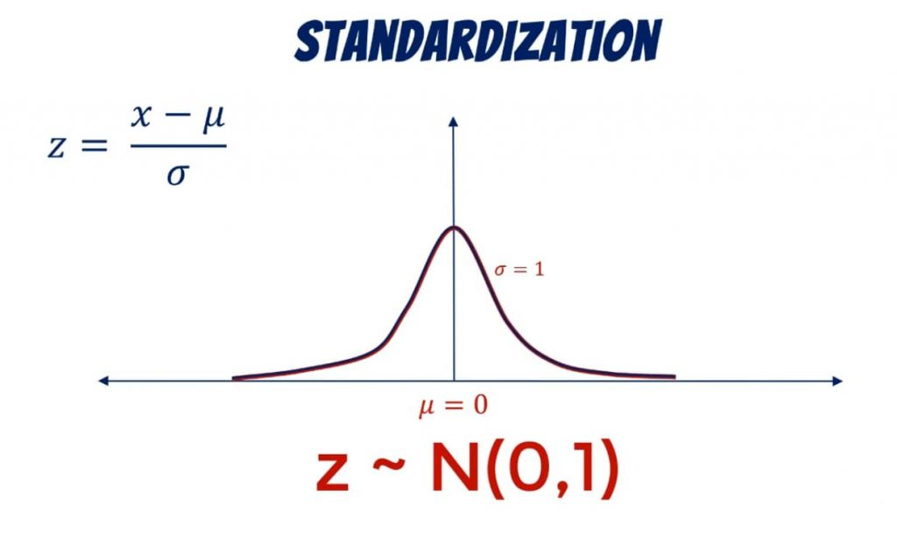
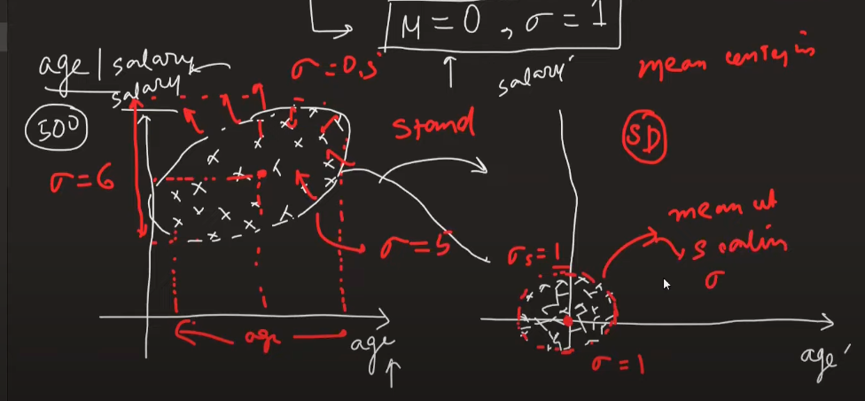
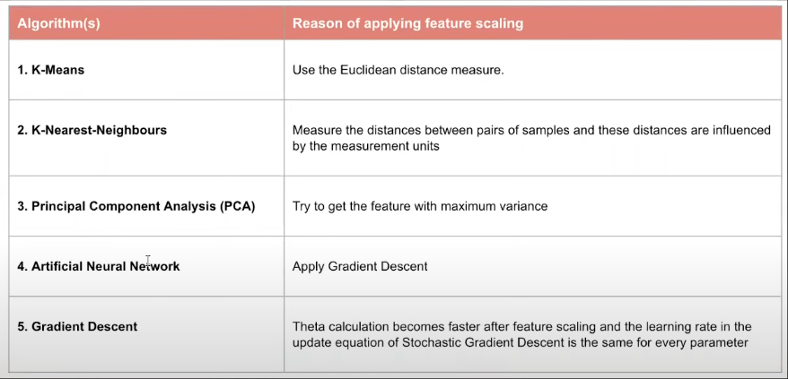
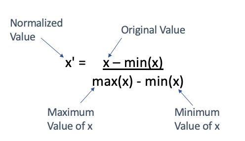
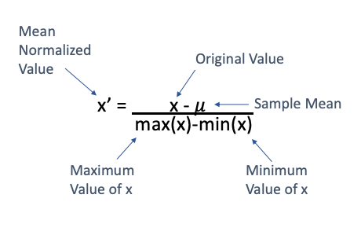
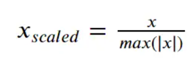
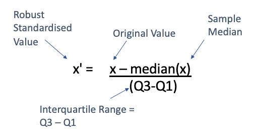
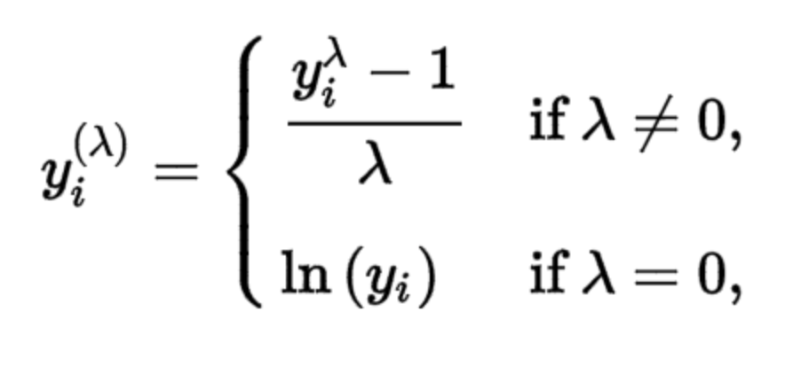
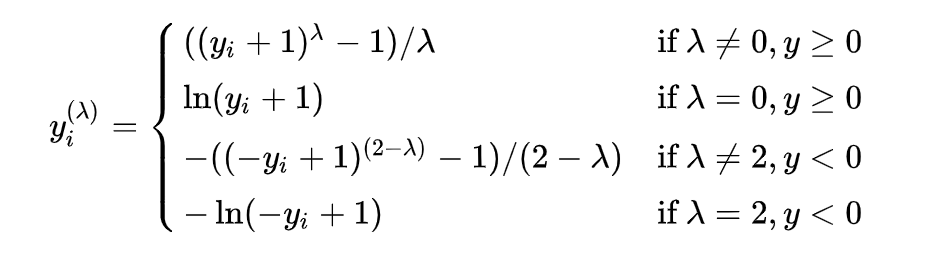

# Feature Scaling

Feature scaling is a technique to standardise the independent features present in the data in a fixed range.

## Scaling and Normalisation

### Types of Scaling

#### 1. Standardisation (Z-score normalisation)

Transform numerical values with formula:

- Mean will be zero and standard deviation will be 1
- Mean centering will be done

- Scaling doesn't have an effect on decision trees output and outliers as well

**When to apply standardisation:**

#### 2. Normalisation

Normalisation is a technique of data preparation. Goal of normalisation is to change values of numeric columns in dataset to use common scale, without distorting differences in ranges of values or losing info.

Eliminate units of the data and normalise to common scale.

##### Min Max Scaling

- Data is in the range of 0 to 1

##### Mean Normalisation

- The values are scaled to -1 to 1
- No one uses this, only useful when we need centred data generally we use standardisation for that

##### Max Abs Scaling

- We use this when we have sparse data means if the data has zeros as majority

##### Robust Scaling

- If data has outliers then we use robust scalar

## Normalisation vs Standardisation

- Whether if scaling is required?
- MinMax is used when we know the min and max is already known
- If the max and min are not known use standard scalar

## Encoding

Categorical data is of two types:

- **Nominal** - no order among categories - states of country
- **Ordinal** - order in data - marks

### Ordinal Encoding

- If we apply encoding on input features we use Ordinal encoder if we apply the transformation on output its called label encoder

### One Hot Encoding

- This is for nominal data, we create separate column for each category
- In one hot encoding if there are n categories we use n-1 columns to represent so that there is no multicollinearity this is called dummy variable trap
- To reduce the dimensions we only consider top frequent categories and remaining can be considered under others category

## Scikit-learn Column Transformer

Scikit-learn column transformer transforms all the transformations we need to apply on dataset.

### **If you're using a power transformation** (like **Box-Cox** or **Yeo-Johnson**) to make data **normally distributed**:

- **Do it *before* scaling**.
- These transformations assume **positive values** (Box-Cox) or any real values (Yeo-Johnson), and they affect the **distribution shape**.

## Mathematical Transformations

- Log transformations
- Reciprocal transformations
- Power transformations (square, square root)
- Box Cox
- Yeo Johnson
- Function transformer
    - Log transformations - makes right skewed data into normally distributed data
    - Square transformation - used for left skewed data

### Power Transformer

#### Box Cox Transformer

- The range of lambda is from -5 to 5 to find optimal value we examine all values for lambda
- Box Cox transformation is applicable only for numbers > 0

#### Yeo Johnson Transformer

- Improved version of Box Cox transformation to support 0 and negative numbers